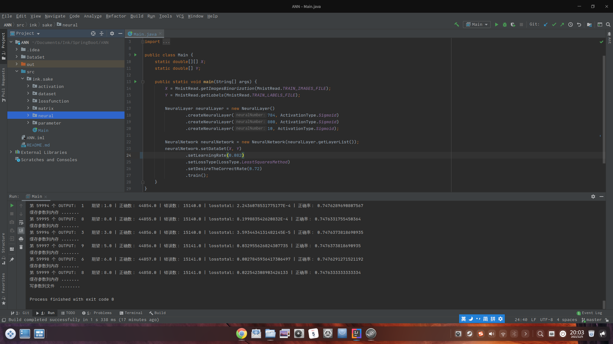

# Multi-layer Perception NeuralNetwork 
## 多层感知器神经网络
**使用Java类构建 Multi-layer Perception NeuralNetwork**

    X = MnistRead.getImagesBinarization(MnistRead.TRAIN_IMAGES_FILE);
    Y = MnistRead.getLabels(MnistRead.TRAIN_LABELS_FILE);
    
    NeuralLayer neuralLayer = new NeuralLayer()
        .createNeuralLayer(784, ActivationType.Sigmoid)
        .createNeuralLayer(800, ActivationType.Sigmoid)
        .createNeuralLayer(10, ActivationType.Sigmoid);
    
    NeuralNetwork neuralNetwork = new NeuralNetwork(neuralLayer.getLayerList());
    neuralNetwork.setDataSet(X, Y)
        .setLearningRate(0.082)
        .setLossType(LossType.LeastSquaresMethod)
        .setDesireTheCorrectRate(0.72)
        .train();
                    
创建感知器网络层和感知器网络，
设置数据集和学习率以及误差函数和期望的准确率，
train就开始训练了。

训练准确率为74.7% ^_^

 